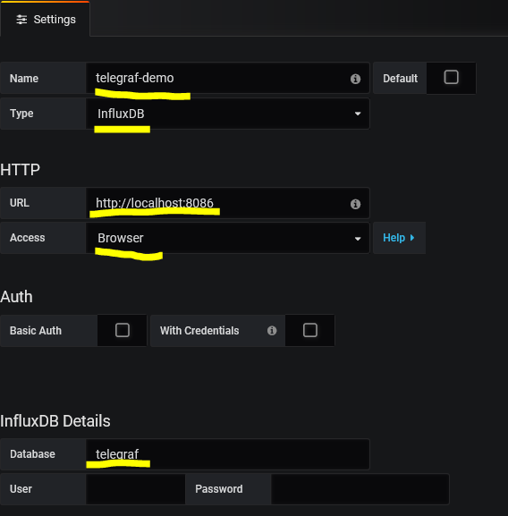
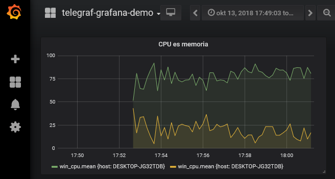
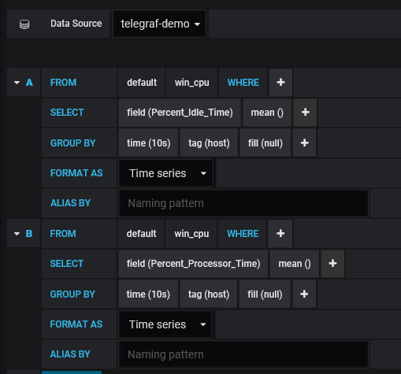

# System monitoring using InfluxDB, Grafana and Telegraf

## Task

We have a computer cluster and we would like to monitor the system resources.

InfluxDB is a "time series database" especially suited for this task. InfluxDB will be the database, Grafana will provide the monitoring fronted website, and Telegraf will populate the database by collecting our system parameters.

## Start the system

We will host InfluxDB and Grafana in Docker, and Telegraf will run as a native application on our host.

1. Download Telegraf https://portal.influxdata.com/downloads. Make sure to download the right version matching your OS.
1. Copy the _telegraf-demo.conf_ file next to the downloaded app. (You do not need to understand this config file.)
1. Start the Docker cluster with command `docker-compose up`
1. Start telegraf with command `telegraf --config telegraf-demo.conf`
1. Open Grafana with a web browser at http://localhost:3000, use admin/admin to log in.

## Create a data source and import dashboard

In Grafa use the _Add datasource_ link.

Use the following settings:

* Name: telegraf-demo (the dashboard we will import references this name)
* Type: InfluxDB
* URL: http://localhost:8086
* Access: browser (this means the browser will query InfluxDB; the other option is the Grafana server to access the DB)
* Database: telegraf (the Telegraf application populates this database)

After saving the data source, use the menu on the left: click the + sign and import a dashboard. Upload the json file _grafana-dasboard.json_, then once the import is complete, open the dashboard.

To see how this diagram is configured, click the header of the diagram and choose _Edit_.

This is an interactive editor where we can specify the database and the queries. The queries are "SQL-like", and the aggregations are expressed just like column aggregations in SQL and as group bys.

## Shutdown

1. Shut Telegram by pressing CTRL-C in its terminal window
1. Stop the Docker containers by pressing CTRL-C in their terminal window.
1. If you no longer need the containers, remove them with the command `docker-compose rm`