# Microsoft SQL Server Business Intelligence

This demo will show the ETL tool (Integration Services) and the reporting application (Reporting Services) from the Business Intelligence suite of Microsoft.

## Task

Let's analyze how the currency exchange rates change over time. We are particularly interested in HUF, EUR and USD currencies.

The data is from <http://sdw.ecb.europa.eu/browse.do?node=9691296>.

### Pre-requisites

* Microsoft SQL Server
* Microsoft Visual Studio 2017
* SQL Server Data Tools (SSDT) for Visual Studio from <https://docs.microsoft.com/en-us/sql/ssdt/download-sql-server-data-tools-ssdt?view=sql-server-2017>
* Data files from the [data](./data) directory

## Data import with Integration Services

### Database

First, create a new database in Microsoft SQL Server with a single table.

```sql
CREATE TABLE [ExchangeRates](
    [Day] [date] NOT NULL,
    [HUF] [float] NULL,
    [USD] [float] NULL
)
GO
```

### Create the ETL process control flow

The developer tool for Integration Services is Visual Studio. Once the _SQL Server Data Tools_ package is installed, new project types are available in the project wizard. Let's create an _Integration Services Project_.

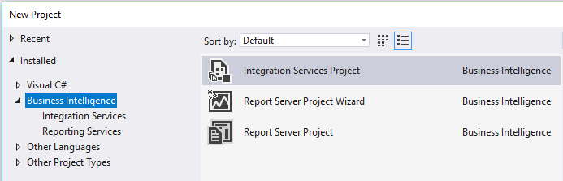

The empty project contains a blank designer surface, where we can drag items from the _SSIS Toolbox_. The current view is the _Control Flow_, which is the entire process of the ETL task.

We shall first purge the DB contents with an _Execute SQL Task_ and then import data with a _Data Flow Tasks_.

 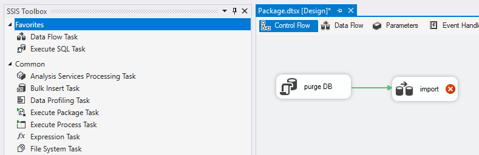

### Configure the Execute SQL task

Every block in the control flow needs further details. Let's configure the task we called _purge DB_. This task will clear the database table (so that if we need to repeat the ETL multiple times, we can start over).

Double click the box to open the details view:

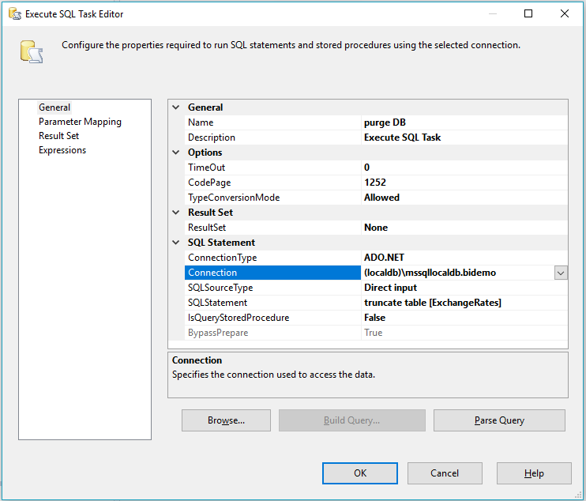

1. In the bottom half of the page, choose _ADO.NET_ connection type.

1. Then create a new connection with the help of a wizard to the SQL Server with similar configurations (adapt as needed to your environment):

    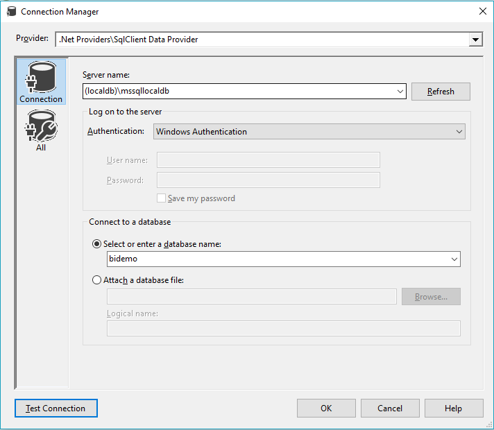

    This connection is saved as an object, which is referenced by the _Execute SQL Task_. The connections are at the bottom of the designer:

    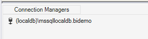

    If you need to change these details, open the connection manager, not the sql task!

1. Finally, enter the command `truncate table [ExchangeRates]`.

1. Close the dialog with OK.

### Configure the CSV import data flow task

Open the _import_ data flow task, that brings us to another empty page. This is a data flow description, where the building blocks are dragged from the _SSIS Toolbox_.

1. Get a _Flat file source_ from the toolbox. This will read the CSV file.

1. Double click the box to open the details dialog.

1. Create a _Flat file connection manager_:

    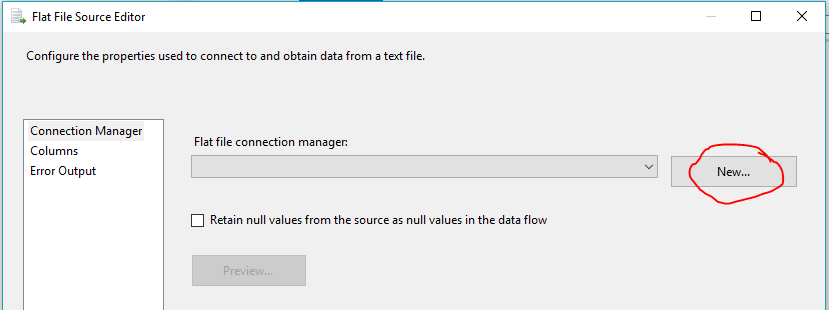

1. Use a meaningful name for the connection, find the _HUF.csv_ file, and uncheck the _Column names in the first data row_ checkbox. You can also review the other settings on this page which need no change.

    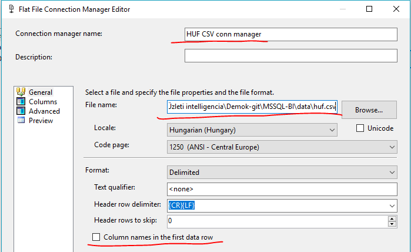

1. Switch to the _Columns_ page, and review the settings. The column separator should be semicolon, and in the preview there should be two columns.

    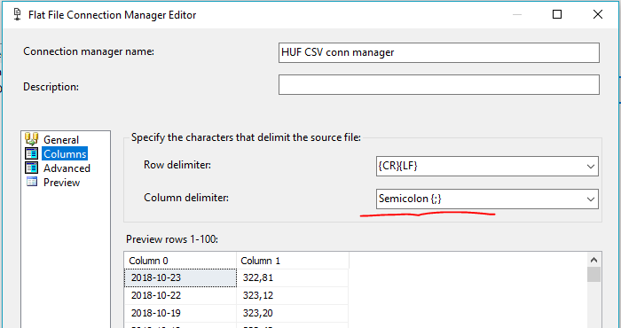

1. Go to the _Advanced_ page. Here you can configure each individual column. We have to give names to the columns, as well as select the right data type. Use the _Suggest Types..._ button to have the system read the CSV and suggest data types. Or configure them manually:

    First column should have name _Day_ and have DataType _date [DT\_DATE]_.

    The other column should have name _HUFRate_ and have DataType float [DT\_R4]_.

    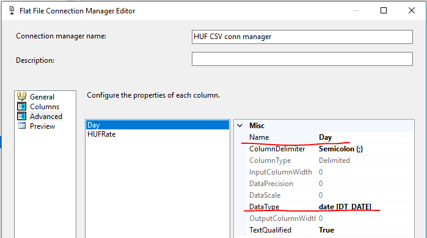

1. The configuration of the flat file source is ready. Close the dialog.

1. Create a similar _Flat File Source_ for importing the _USD.csv_ file. Use _USDRate_ column name.

1. The two CSV files are parsed into two two-column datasets. We should merge the two on the day field. Let's use a _Merge join_ transformation for this, which requires its inputs to be sorted, so let's sort them first with two _Sort_ transformations.

    Drag two _Sort_ boxes from the toolbox and connect the blue arrow from each flat file task into one of the sort boxes. The blue arrow is the output of the CSV read tasks; the red is the error output of failed records.

    Open both _Sort_boxes and check the _Day_ column to sort the dataset based on this.

    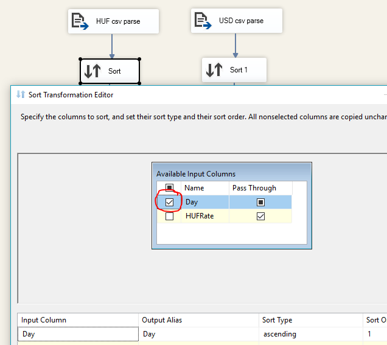

1. Now let's connect both sort outputs into a _Merge_ transformation. Open the merge properties. Select the two _Day_ columns as the merge keys. And check the _Day_, _HUFRate_ and _USDRate_ columns to be the output of the transformation.

    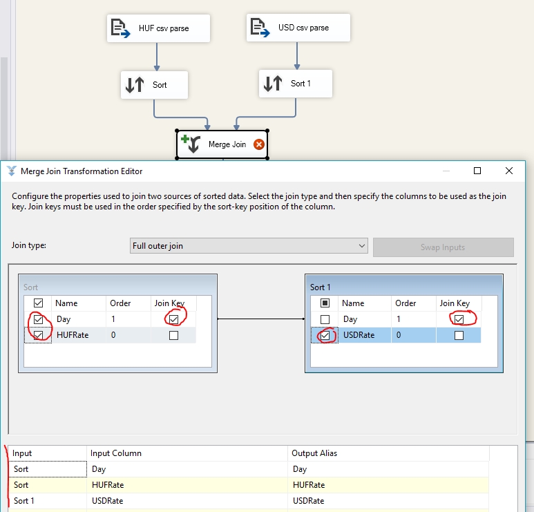

1. Finally, let's write the combined data into the database. We need an _ADO NET Destination_ element from the toolbox connected into the output blue arrow of the merge join task. Open the configuration of this box.

    The _Connection manager_ specifies the database server to connect to. We already created one before, let's select this connection manager. Once this is configured, you can select the table from the dropdown.

    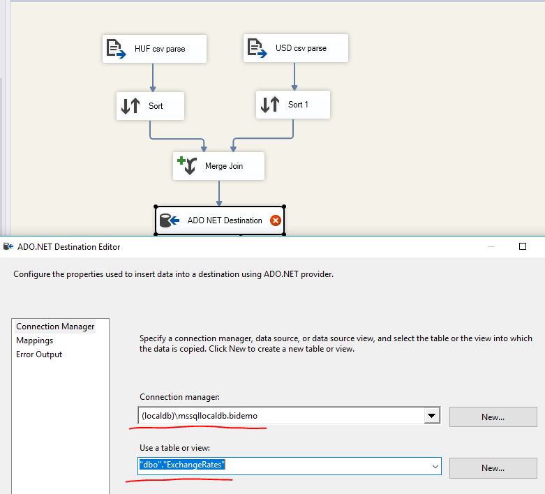

    Switch to the _Mappings_ page and set the mapping between the fields here and the columns in the database. The _Day_ mapping is recognized by the identical name. Th other two columns need to be mapped manually.

    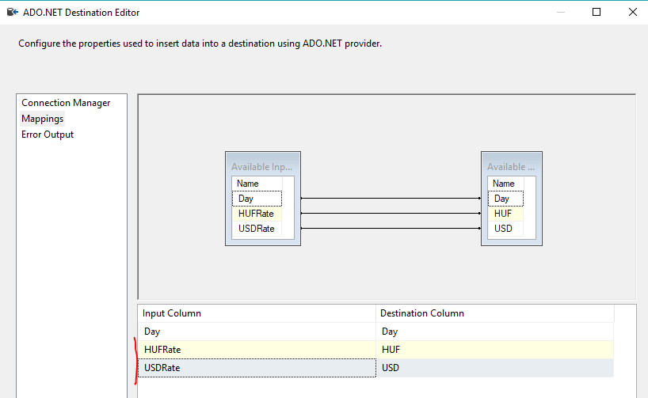

### Run the process

The ETL process is finished. Let's run it. In Visual Studio the standard _Start_ button is available on the toolbar. Press it.

The execution will fail:

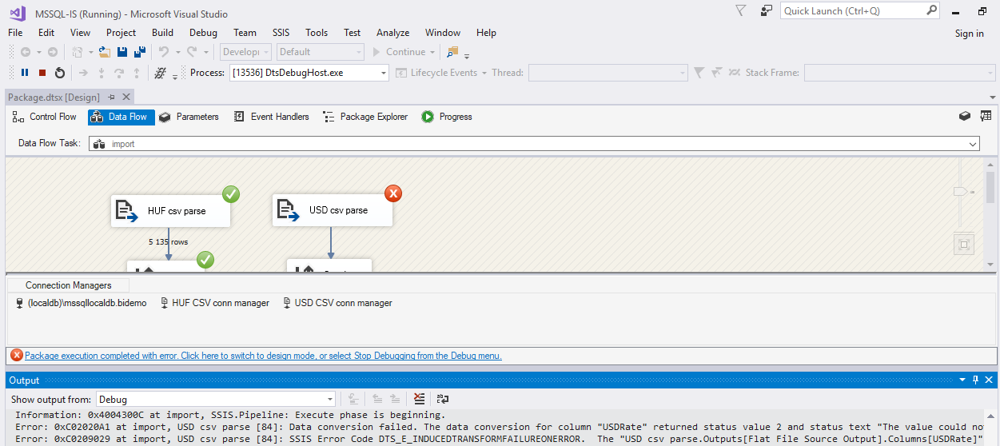

Open the _Output_ window and check the error.

```
Error: 0xC02020A1 at import, USD csv parse [84]: Data conversion failed. The data conversion for column "USDRate" returned status value 2 and status text "The value could not be converted because of a potential loss of data.".
...
Error: 0xC0202092 at import, USD csv parse [84]: An error occurred while processing file "data\usd.csv" on data row 1659.
```

It says that there is a conversion error, and specifies the row number as well. If you open the CSV file and find this row, you will see that it is indeed erroneous, it does not have a valid number.

Invalid source data is frequent. We should not fail the entire process just because one row is invalid. Let's skip it.

1. Stop the execution.

1. Double click the CSV read steps (both) and go to the _Error Output_ pane.

1. Change the _Fail component_ to _Ignore failure_ for the _HUFRate_ and _USDRate_ columns.

    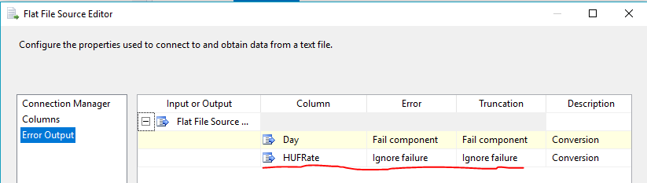

Now run the process again. It will succeed.

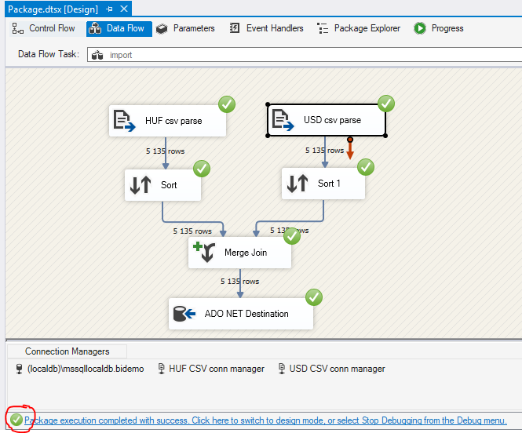

### Verify the result

Check the result of the import in the database by previewing the contents of the table.

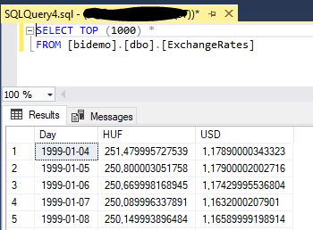