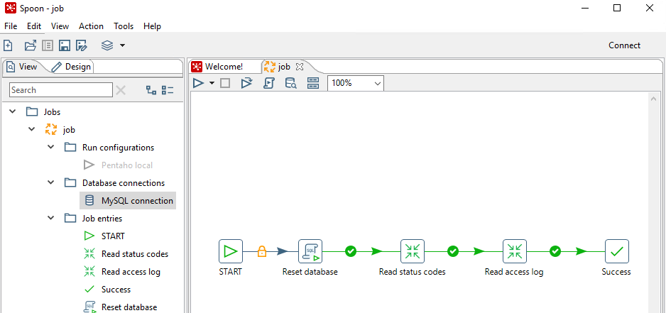
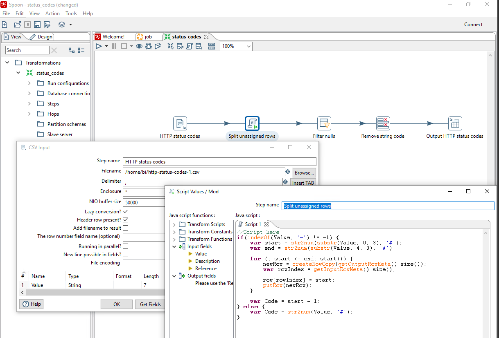
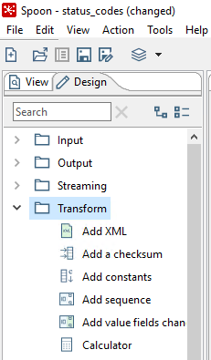
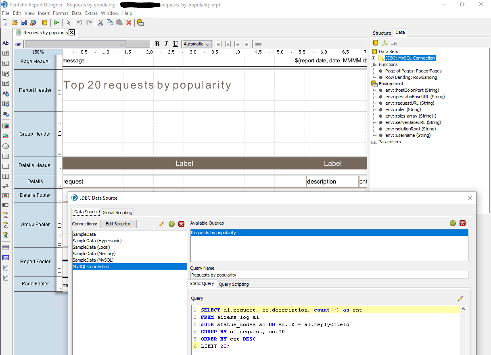

# Pentaho

Pentaho is an open source Business Intelligence platform. This example demonstrates the ETL and reporting capabilities of the Pentaho suite.

## Task

We have web server logs from <http://ita.ee.lbl.gov/html/contrib/NASA-HTTP.html>. These contain real-life http server access logs. We will join this dataset with a text-based datasource from <https://www.iana.org/assignments/http-status-codes/http-status-codes.xhtml> containing http status codes and their description. (Use the the CSV format.)

After loading these datasets into a MySQL relational database, we will create reports that show us

* the most frequent pages visited,
* the pages with the largest data to transfer,
* and the distribution of the http response codes.

### Pre-requisites

* Pentaho Data Integration and Pentaho Report Designer from <https://sourceforge.net/projects/pentaho/>, see [installation guide](https://help.pentaho.com/Documentation/8.1/Setup/Installation/Manual)
* MySQL
* Data sources from the links above

## Importing the data

We will import the raw data into a relational database.

### Prepare the database table

Create a new database with two tables

* one for the http status codes and their description;
* and the other for the web server access logs.

See the sql scripts in [database-scripts](./database-scripts).

### ETL job with Pentaho Data Integration (Spoon)

The web server access logs contain data in tab separated format:

```
d104.aa.net - - [01/Jul/1995:00:00:13 -0400] "GET /shuttle/countdown/ HTTP/1.0" 200 3985
129.94.144.152 - - [01/Jul/1995:00:00:13 -0400] "GET / HTTP/1.0" 200 7074
unicomp6.unicomp.net - - [01/Jul/1995:00:00:14 -0400] "GET /shuttle/countdown/count.gif HTTP/1.0" 200 40310
unicomp6.unicomp.net - - [01/Jul/1995:00:00:14 -0400] "GET /images/NASA-logosmall.gif HTTP/1.0" 200 786
unicomp6.unicomp.net - - [01/Jul/1995:00:00:14 -0400] "GET /images/KSC-logosmall.gif HTTP/1.0" 200 1204 
```

Each line is one record with the request source, timestamp, queried resource, response code and size of response. This data is imported-as is.

The datasource containing the http status codes is a CSV file, but the column with the status codes contain strings like "104-199", which need to be split into individual records.

```
Value,Description,Reference
100,Continue,"[RFC7231, Section 6.2.1]"
101,Switching Protocols,"[RFC7231, Section 6.2.2]"
102,Processing,[RFC2518]
103,Early Hints,[RFC8297]
104-199,Unassigned,
```

With _Spoon_ the ETL tool in the Pentaho suite, open the ETL job file _etl-jobs/job.kjb_. This file is the descriptor of the entire ETL process. On the left we see the configuration of the job, such as the connection(s) to data sources and data targets. These configurations are then references in the steps. The individual job steps are described as a control flow process (the boxes on the right connected with arrows showing the process flow).



Open file _etl-jobs/status\_codes.ktr_ to review the description of the step that processes the http response codes text file. This task is a process itself, but in this case it is a _data flow_ task. The steps of this process are linked logically as the data should flow through them. Each step has its options, such as the file name to process, or the task that splits the rows with number ranges in them with a JavaScript method.



These steps, the building blocks are built-in functionality of Pentaho & Spoon. Spoon is a visual designer, where you can drag one the tasks from the _Design_ and then double click to edit its details.



### Running the sample ETL process

Please note that the sample ETL process has hard-wired paths. To run the process you need to edit each step in the job and replace if it has paths in them.

## Reports with Pentaho Report Designer

The reports are built with Pentaho Report Designer. The source data of the reports in the MySQL database populated by the ETL process.

Open file _reports/requests\_by\_popularity.prpt_ with Report Designer. The report designer is a WYSIWYG-type editor, where you can arrange the information in your report on a page. This type of report is best suited for static data that is printed or distributed as pdf files.



The data itself comes from the database as a result of a query (as shown above). The results are placed in a table in the _details_ section of the report. In the designer, the table has a single row, but when rendered with the data the, the table will contain 20 rows.