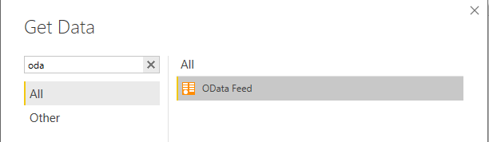
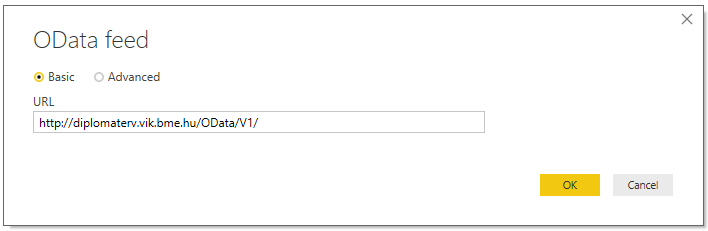
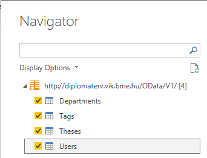
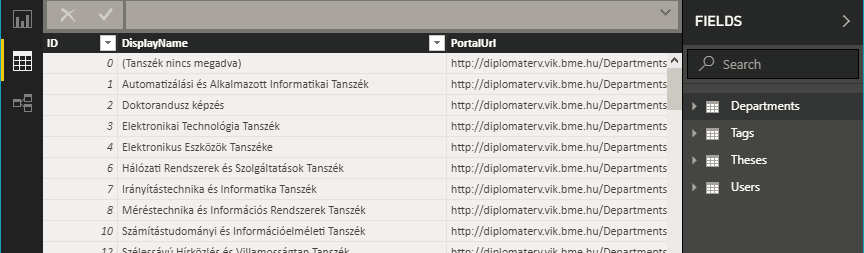
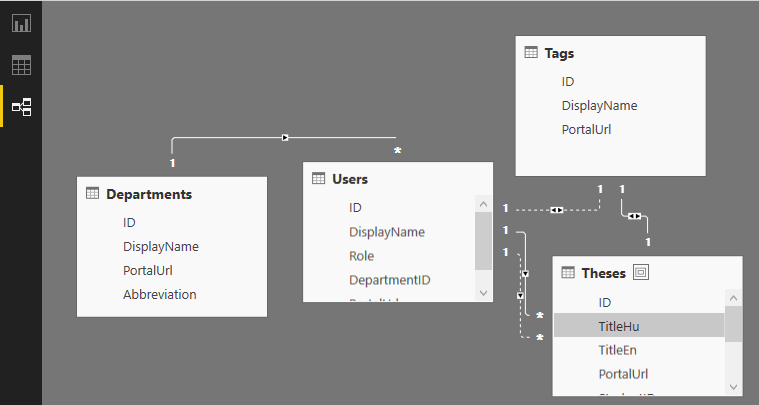
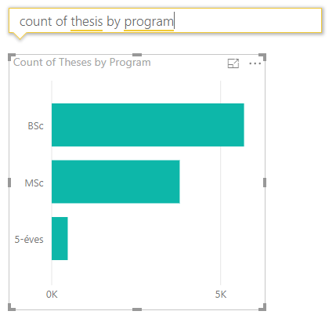
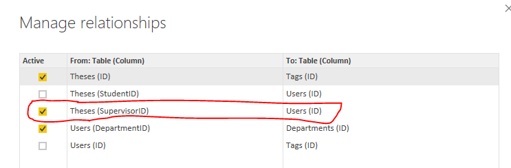
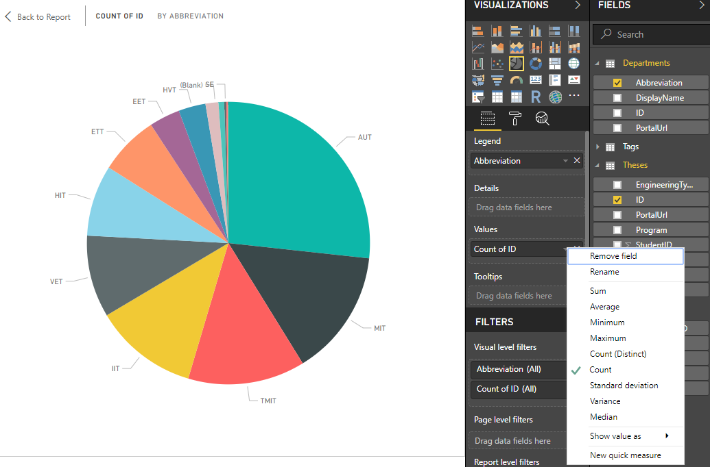

# Data visualization with Power BI

Power BI Desktop is a desktop application specifically for creating visually appealing diagrams and dashboards.

## Pre-requisites

* Power BI Desktop

## Importing the data

The data is available from an online service. This service is the "Diplomaterv portál" (Thesis portal), which publishes the data using [OData](<https://en.wikipedia.org/wiki/Open_Data_Protocol>). The description of the data is available at <https://diplomaterv.vik.bme.hu/hu/OData>.

1. Start Power BI and connect to an OData service at <http://diplomaterv.vik.bme.hu/OData/V1/>.

    

    

    OData is self-descriptive; it has a published schema. Power BI will fetch this schema and show the "tables" we can import. Lets import all.

    

    Wait for the import to complete. It will take some time for Power BI to fetch all data.

1. Lets check the data we imported. On the left of the window you find navigation icons; click the second one to switch to the data page.

    

    While downloading the data Power BI also discovered the connections among these tables. (This is due to the OData source having a schema.)

    

    If the data consists of multiple sources, you can edit the connections between them here. The concept is similar to a relational data base model.

It is important to understand that Power BI Desktop stores the data. That is, the reports we will create represent the dataset at the time of downloading. To update the data from the data source at a later time use the _Refresh_ ribbon command.

## Reports

Let's switch to the _Report_ page (which is empty currently). We can add diagrams and visualizations. This page serves as a dashboard, which can also be published to the web.

### Number of theses by type (BSc, MSc)

On the ribbon click the _Ask a question_ button. This function automates simple diagram creation by typing your query as an English question. E.g. type "count of thesis by program" (where program is the column name for BSc/MSc). This automatically yields this diagram.

### Number of theses by supervisor's Department

Every thesis has a supervisor, who is associated with a department. Let's create a pie chart showing the number of theses per department.

1. First, let's make sure the thesis - supervisor connection is properly configured. Go to the _Relationships_ page and click the _Manage relationships_ icon on the ribbon.

1. Observe that _Thesis_ and _Users_ have two connections: one for the supervisor and one for the student. Only supervisors are associated with departments, so we need the connection through _SupervisorId_. But this connection is not active (the checkmark is empty).

1. Try and check this connection too.

    

    Power BI will warn that the connection is ambiguous. It cannot handle multiple connections between tables. So we need to uncheck the _Theses (StudentId)_ connection and keep only the  _Thesis (SupervisorId)_ to _User_ connection.

1. Now go back to the _Reports_ page, and add a new column diagram.

    Drag the _Abbreviation_ from the _Department_ table to the _Legend_ area, and _ID_ from _Thesis_ into the _Values_ area, then select the Count metric.

    