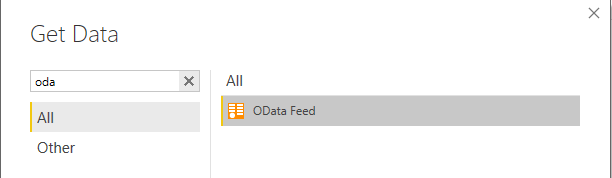
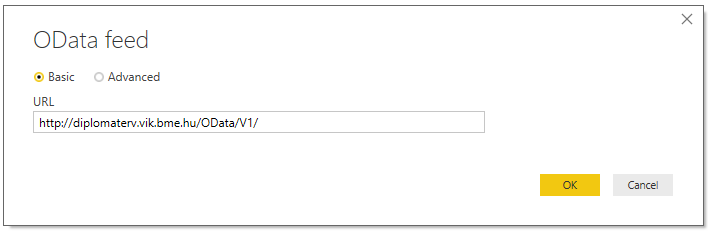
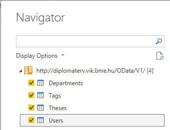
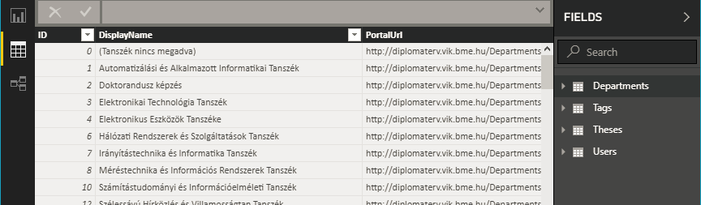
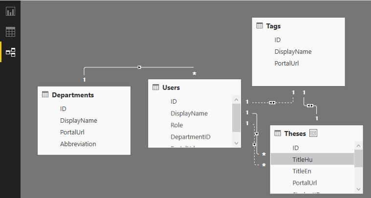
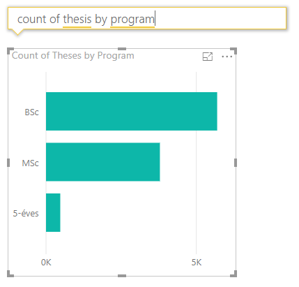
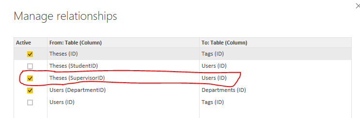
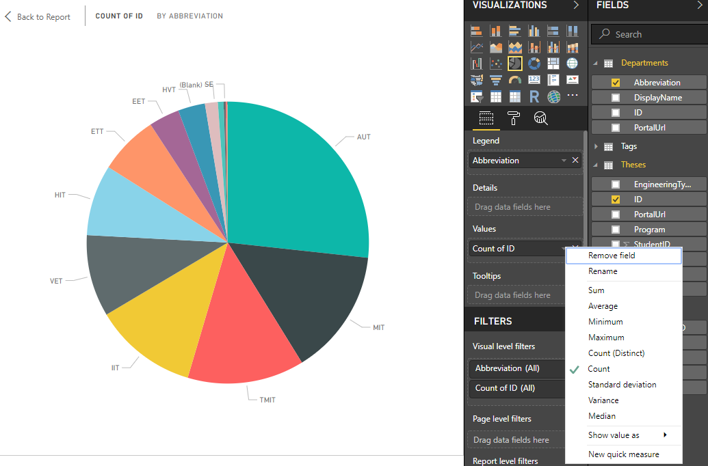

# Data visualization with Power BI

Power BI Desktop is a desktop application specifically for creating visually appealing diagrams and dashboards.

## What is Power BI?

Power BI is Microsoft's business intelligence tool that enables:
- Collecting data from various sources
- Cleaning and transforming data
- Creating interactive visualizations and reports
- Building and sharing dashboards
- Analyzing data and gaining insights

## Pre-requisites

* Power BI Desktop (free to download from [Microsoft's website](https://powerbi.microsoft.com/desktop/))
* Microsoft account (optional, but useful for Power BI Service)
* Basic database management knowledge (beneficial but not required)

## Power BI Components

Power BI consists of three main components:

1. **Power BI Desktop**: Desktop application for creating reports and visualizations
2. **Power BI Service**: Cloud-based service for sharing reports and collaboration
3. **Power BI Mobile**: Mobile app for viewing reports on the go

## Importing the data

The data is available from an online service. This service is the "Diplomaterv portál" (Thesis portal), which publishes the data using [OData](<https://en.wikipedia.org/wiki/Open_Data_Protocol>). The description of the data is available at <https://diplomaterv.vik.bme.hu/hu/OData>.

1. Start Power BI and connect to an OData service at <http://diplomaterv.vik.bme.hu/OData/V1/>.

    

    

    OData is self-descriptive; it has a published schema. Power BI will fetch this schema and show the "tables" we can import. Lets import all.

    

    Wait for the import to complete. It will take some time for Power BI to fetch all data.

1. Lets check the data we imported. On the left of the window you find navigation icons; click the second one to switch to the data page.

    

    While downloading the data Power BI also discovered the connections among these tables. (This is due to the OData source having a schema.)

    

    If the data consists of multiple sources, you can edit the connections between them here. The concept is similar to a relational data base model.

It is important to understand that Power BI Desktop stores the data. That is, the reports we will create represent the dataset at the time of downloading. To update the data from the data source at a later time use the _Refresh_ ribbon command.

## Power Query Editor

After importing data, you can transform and clean it using the Power Query Editor:

1. Click the "Transform Data" button in the ribbon
2. The Power Query Editor opens, where you can perform various data transformation operations:
   - Rename, remove, or rearrange columns
   - Change data types
   - Filter and sort
   - Create conditional columns
   - Remove duplicates
   - Merge or split data
   - Create custom formulas using the "Add Custom Column" feature

The transformation steps are recorded and automatically applied when refreshing the data.

## Data Modeling

One of Power BI's strengths is data modeling:

1. **Managing relationships**: Creating and editing relationships between tables
2. **Calculated columns**: Using DAX (Data Analysis Expressions) formulas to create new columns
3. **Measures**: Calculating aggregated values using DAX
4. **Hierarchies**: Structuring data into multi-level hierarchies
5. **Roles**: Setting up data security for different user roles

### DAX Basics

DAX is a formula language specifically developed for data analysis and calculations:

```
// Simple calculated column
TotalPrice = Products[UnitPrice] * Products[Quantity]

// Creating a measure
Total Sales = SUM(Sales[Amount])

// Filtered measure
Current Year Sales = CALCULATE(SUM(Sales[Amount]), YEAR(Sales[Date]) = YEAR(TODAY()))
```

## Reports

Let's switch to the _Report_ page (which is empty currently). We can add diagrams and visualizations. This page serves as a dashboard, which can also be published to the web.

### Number of theses by type (BSc, MSc)

On the ribbon click the _Ask a question_ button. This function automates simple diagram creation by typing your query as an English question. E.g. type "count of thesis by program" (where program is the column name for BSc/MSc). This automatically yields this diagram.



### Number of theses by supervisor's Department

Every thesis has a supervisor, who is associated with a department. Let's create a pie chart showing the number of theses per department.

1. First, let's make sure the thesis - supervisor connection is properly configured. Go to the _Relationships_ page and click the _Manage relationships_ icon on the ribbon.

1. Observe that _Thesis_ and _Users_ have two connections: one for the supervisor and one for the student. Only supervisors are associated with departments, so we need the connection through _SupervisorId_. But this connection is not active (the checkmark is empty).

1. Try and check this connection too.

    

    Power BI will warn that the connection is ambiguous. It cannot handle multiple connections between tables. So we need to uncheck the _Theses (StudentId)_ connection and keep only the  _Thesis (SupervisorId)_ to _User_ connection.

1. Now go back to the _Reports_ page, and add a new column diagram.

    Drag the _Abbreviation_ from the _Department_ table to the _Legend_ area, and _ID_ from _Thesis_ into the _Values_ area, then select the Count metric.

## Creating Additional Visualizations

Power BI offers numerous visualization types:

### Time Series Analysis

1. Create a line chart showing the number of theses over time:
   - Drag the date field to the X-axis
   - Drag the thesis ID to the Y-axis (Count)
   - Use filters to select specific time periods

### Creating Interactive Filters

1. Add slicers to your report:
   - Select the "Slicer" visualization from the visualization panel
   - Drag a field (e.g., Department, Program) to the slicer
   - The slicer now acts as an interactive filter for all visualizations in the report

### Map Visualization

If you have geographical data (e.g., students' places of origin):
1. Select the "Map" visualization
2. Drag the geographical data (city, country) to the "Location" field
3. Drag the metric (e.g., number of students) to the "Size" field

### Cards and KPIs

For highlighting important metrics:
1. Select the "Card" or "KPI" visualization
2. Drag the desired metric to the "Value" field
3. For KPIs, specify a target value as well

## Sharing Dashboards and Reports

Power BI Desktop reports can be shared in several ways:

1. **Publishing to Power BI Service**:
   - Click the "Publish" button in the ribbon
   - Sign in with your Microsoft account
   - Select the workspace where you want to publish

2. **Exporting to various formats**:
   - PDF
   - PowerPoint
   - Image file (.png)

3. **Embedding in websites**:
   - Publish the report to Power BI Service
   - Use the "Share" or "Embed" options
   - Copy the embedding code to your website

## Power BI Service Features

Power BI Service offers additional features:

1. **Dashboards**: Combining visualizations from multiple reports into an overview interface
2. **Scheduling data refresh**: Setting up automatic data refreshes
3. **Apps**: Grouping and sharing reports and dashboards
4. **Mobile view**: Optimizing reports for mobile devices
5. **Alerts**: Setting up notifications for data changes
    
