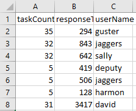
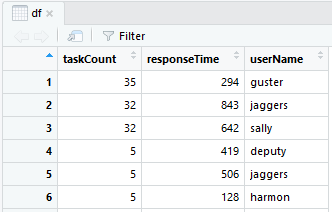
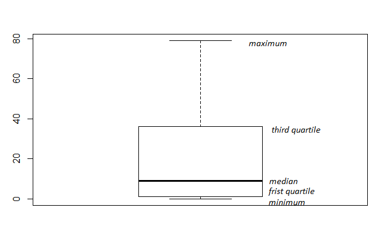

# Using R for data analysis

## Further reading material

* About R: http://www.r-tutor.com/r-introduction
* Correlation and linear regression: https://datascienceplus.com/correlation-and-linear-regression/

## Problem statement

We have a cool website, where people manage their tasks (like Jira, or Asana). We are rolling out a new UI design. We are interested in how many tasks generally do people have, because it would help us determine the size of the list to display. E.g. should we list only the first 5 items, or the first 50?

We are concerned with usability as well as the performance of the app. The more tasks we display, the more resources it will need (e.g. database access).

We are given a text file that is taken from our current website's telemetry service. It contains the number of tasks people list on their current front page, and the time it takes for the server to render the page.



## Goal

We are given the following tasks:

* find the average of the number of tasks users have;
* provide additional statistical measures of the same value (such as quartiles);
* and see if there is evidence that the number of tasks correlates with the response times.

## Importing the data

Let us start with importing the data into R. The simplest representation is the [dataframe](http://www.r-tutor.com/r-introduction/data-frame). It is similar to an Excel sheet with columns storing the attributes and rows containing the data.

```R
df <- read.csv(file="webapp-openpage-itemlist.csv", header=TRUE, sep=';')
```

We can preview the content of the dataframe:

```R
View(df)
```



The data is now imported. Let's see how many we have.

```R
nrow(df)

[1] 1944
```

## Average task count

Let's see the average of the task counts by using the [mean](https://stat.ethz.ch/R-manual/R-devel/library/base/html/mean.html) function. We pass the _taskCount_ column of the dataframe to the mean.

```R
mean(df$taskCount)

[1] 22.51337
```

We know already that the average is prone to outliers, so we should remove the lowest and highest values. The _mean_ function can do that too with the _trim_ parameter, which is the fraction of all observations (elements) to remove from both ends of the value range.

```R
mean(df$taskCount, trim=0.1)

[1] 18.72943
```

The average, even after the outlier removal, can be a misleading value. The problem is that it is hard to qualify what is an outlier. Let's look at the median instead. The median is the numeric value separating the higher half of a population from the lower half. (You can image in by listing all values in an ascending order, and choosing the number right in the middle of this ascending sequence.)

```R
median(df$taskCount)

[1] 9
```

The value 9 means that there is exactly as many occasions of people having less than 9 tasks, than people having more than 9. In other words, if we were to list the first 9 tasks on our new website, half of our users would see all their tasks.

Let's visualize this with a [boxplot](https://www.tutorialspoint.com/r/r_boxplots.htm). The boxplot shows the minimum, maximum, median, first quartile and third quartile in the data set.

```R
boxplot(df$taskCount)
```



From this visualization we see that the third quartile is around 40, meaning that in 75% of the cases people have less than 40 tasks.

So we should list at least 9, and probably less than 40 items.

## Does the number of tasks correlates with the response times?

In other words, is there a performance penalty is displaying more items on the first page?

To determine this, we need to perform a _correlation test_. With the correlation test we can evaluate if there is an association between two or more variables. One of the most frequently used methods is calculating the [Pearson correlation coefficient](https://en.wikipedia.org/wiki/Pearson_correlation_coefficient). There is built-in support for calculating this.

```R
cor.test(df$taskCount, df$responseTime, method = "pearson")

	Pearson's product-moment correlation

data:  df$taskCount and df$responseTime
t = 1.5871, df = 1942, p-value = 0.1126
alternative hypothesis: true correlation is not equal to 0
95 percent confidence interval:
 -0.008479294  0.080321550
sample estimates:
       cor
0.03599217
```

Pearson R is close to 0, meaning no correlation between the task count and the response time. Hence, increasing the number of tasks to display on the first page is not expected to have any performance penalty.

## Conclusion

R and other statistical tools are convenient for working with moderate size datasets when we need to do mathematical and statistical computations. Working with these software, however, requires less programming skills than mathematical background. These tools are frequently used by _data scientists_.