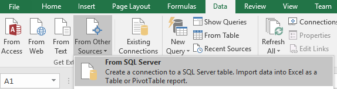
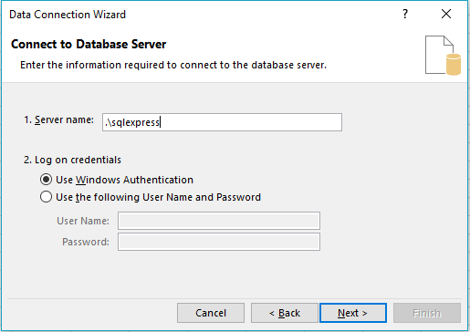
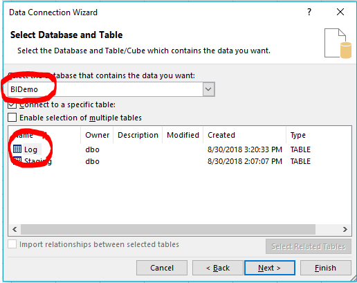
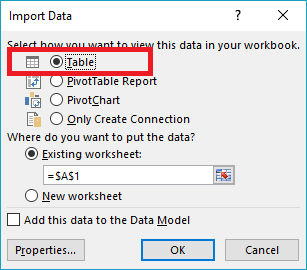
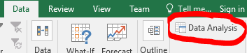
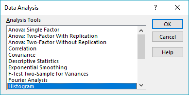
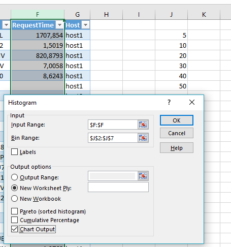
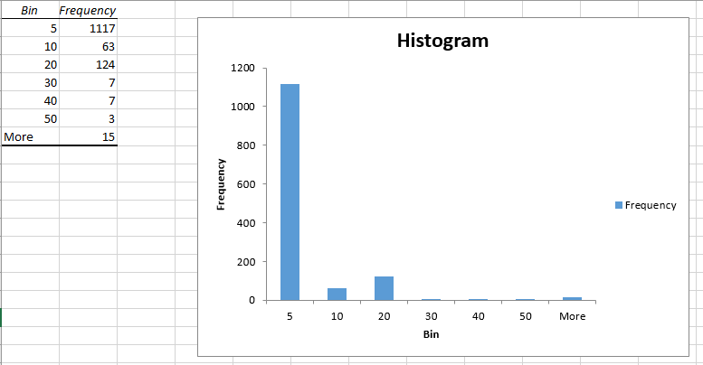
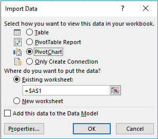
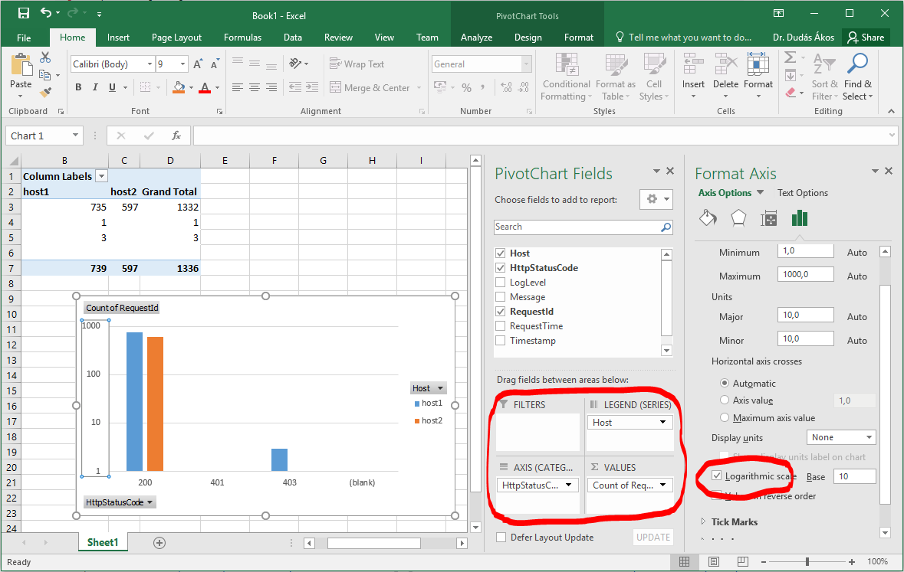

# Using relational database as a business intelligence system - DEMO

This demo will demonstrate how to build a simple business intelligence system. We will also focus on the common problems of data processing in such systems, that we will cover in more detail during the course.

## Goal

We have a log from a cluster of web servers in text form. We are seeking to understand if there are problems that need addressing. We also want some basic statistical figures that gives us a hint if there are performance issues within the system.

## Let's make a plan

In order to get some answers from the dataset, we need to process it. And in order to process it, we need to understand what it contains, so we can find the right tools.

First, let us see what the data contains. This is an excerpt from the log.

```
"_id";"timestamp";"exception";"httpStatusCode";"logLevel";"message";"requestId";"requestNum";"requestTime";"host"
"ez8eDGIBhK6LQO766OFQ";"2018. 03. 09. 18:56:09";"";"200";"Information";"Request finished in 1707.854ms 200 application/json; charset=utf-8";"0HLC5TTL7UGQL";"1";"1707.854";"host1"
"y_iMGmIBvTB7p1paO9GP";"2018. 03. 12. 14:10:11";"";"200";"Information";"Request finished in 1.5019ms 200 application/json; charset=utf-8";"0HLC812GHTLN2";"1";"1.5019";"host1"
"hyuFGmIBN-IoXSlIdl_O";"2018. 03. 12. 14:02:33";"";"200";"Information";"Request finished in 8.6243ms 200 application/json; charset=utf-8";"0HLC812GHTLN0";"1";"8.6243";"host1"
"PWwCH2IB-6ZMWBq_b31K";"2018. 03. 13. 10:57:14";"";"";"Warning";"System check warning: DB not available";"";"";"";"host1"
```

We see that this is a CSV-like text format, which makes processing easy.

We will process the data using Microsoft SQL Server, SQL command, and Microsoft Excel in the following way:

1. Import the log file into a so called _staging_ area as-is.
1. Transform the raw data to fit further processing needs (e.g. parse string to date type).
1. Use CLR integration to parse custom datetime string.
1. Check the request times, see if there is any indication of a performance issue.
1. See if there is indeed significant performance different between the hosts in the system (which would indicate a configuration error.)
1. Visualize the ratio of success / error requests in Excel.

### Pre-requisites

* Microsoft SQL Server (express edition suffice)
* A new, empty database
* The log file, placed in a directory where SQL server can access it (_not_ My Documents, Desktop, or alike)
* Microsoft Visual Studio
* Microsoft Excel

## Importing the data

First, we map the data in the log file directly, and import everything as text. Let's create a table in the database for this.

```sql
CREATE TABLE [Staging]
(
	[Id] [nvarchar](50) NULL,
	[Timestamp] [nvarchar](50) NULL,
	[Exception] [nvarchar](500) NULL,
	[HttpStatusCode] [nvarchar](10) NULL,
	[LogLevel] [nvarchar](50) NULL,
	[Message] [nvarchar](4000) NULL,
	[RequestId] [nvarchar](50) NULL,
	[RequestNum] [nvarchar](50) NULL,
	[RequestTime] [nvarchar](20) NULL,
	[Host] [nvarchar](50) NULL
)
```

We can import the log file directly with the following command. The WITH options specify how the CSV-like file is to be parsed. (Note. You need to specify a full path in FROM.)

```sql
BULK INSERT [Staging]
FROM 'webserverlog.log'
WITH
(
	FORMAT = 'CSV',
	FIELDTERMINATOR =';',
	FIELDQUOTE = '"',
	ROWTERMINATOR ='0x0a',
	FIRSTROW = 2
)
```

Let's validate if the import succeeded.

```sql
select top 3 * from [Staging]
```

```
2tmlaGIBd696Dn2qQKrP	2018. 03. 27. 18:08:02	NULL	200	Information	Request finished in 35.0369ms 200 	0HLC90A8E7MUM	1	35.0369	host1
l9mBa2IBd696Dn2qRqsU	2018. 03. 28. 7:27:13	NULL	200	Information	Request finished in 1.3827ms 200 application/json; charset=utf-8	0HLC9NV0B0LOA	1	1.3827	host2
kHSda2IBceyQBL6wbqPb	2018. 03. 28. 7:58:13	NULL	200	Information	Request finished in 1.2024ms 200 application/json; charset=utf-8	0HLC9NV0B0LOF	1	1.2024	host2
```

The Staging table contains data in raw format. In order to process it conveniently, it needs some basic transformations:

* Drop columns that we will not use
* Transform non-text columns to their proper representation

We create a new table to store the pre-processed data.

```sql
CREATE TABLE [Log]
(
	[Timestamp] [datetime] NULL,
	[HttpStatusCode] [int] NULL,
	[LogLevel] [nvarchar](50) NULL,
	[Message] [nvarchar](4000) NULL,
	[RequestId] [nvarchar](50) NULL,
	[RequestTime] [float] NULL,
	[Host] [nvarchar](50) NULL
)
```

Parsing to int and float are simple. But we will have trouble parsing the date. SQL Server can parse a date string is various format, but not this format "2018. 03. 28. 7:58:13" To work around the issue, we will write the date parsing in C# and call this C# method from SQL.

### Call a C# method from SQL Server

Create a new _Class library_ type of project targeting any .NET version. Create a single class in this project with the following code.

```Csharp
using System;
using System.Data.SqlTypes;
using Microsoft.SqlServer.Server;

namespace CustomDateParse
{
    public static class CustomDateParse
    {
        [SqlFunction(DataAccess = DataAccessKind.None)]
        public static SqlDateTime ParseDateWithFormat(string value, string format)
        {
            return new SqlDateTime(DateTime.ParseExact(value, format, null));
        }
    }
}
```

After compiling, let's import the dll assembly into SQL Server. We have to enable support for it first, and disable some security checks. In production, there are alternative ways to do this.

```sql
-- Enable CLR integration
sp_configure 'show advanced options', 1
go
reconfigure
go
sp_configure 'clr enabled', 1
GO
sp_configure 'clr strict security', 0
GO
RECONFIGURE
GO

-- Register our assembly in the database
CREATE ASSEMBLY CustomDateParseUdf FROM 'CustomDateParse.dll';
GO
CREATE FUNCTION dbo.ParseDateWithFormat(@value nvarchar(max), @format nvarchar(max))
RETURNS datetime
AS EXTERNAL NAME CustomDateParseUdf.[CustomDateParse.CustomDateParse].ParseDateWithFormat;
GO
```

Let us then test this function. More information on the custom datetime format string (the second argument) is available at <https://docs.microsoft.com/en-us/dotnet/standard/base-types/custom-date-and-time-format-strings>. It should output a properly parsed value.

```sql
select dbo.ParseDateWithFormat('2018. 03. 28. 17:58:13','yyyy. MM. dd. H:m:s')
```

### Finish the import

Now we call the necessary transformations either using SQL methods or the previously written C# function.

```sql
INSERT INTO [Log]
SELECT
	dbo.ParseDateWithFormat([Timestamp],'yyyy. MM. dd. H:m:s'),
	CONVERT(int, [HttpStatusCode]),
	[LogLevel],
	[Message],
	[RequestId],
	CONVERT(float, [RequestTime]),
	[Host]
	FROM [Staging]
```

And finally, the temporary storage is not needed. Let's clear the table.

```sql
truncate table [Staging]
```

## Basic statistics

Let's use SQL queries to get some information. The relational database allows us to quickly process the data (as opposed to having to count lines in a text file). However, it requires _domain knowledge_; both the knowledge of a specialized language, SQL is needed, and the domain knowledge of how the database is structured.

#### Number of requests

We will seek ratio values for certain events. The denominator for all these is the number of requests.

```sql
select count(*)
from [Log]
```

#### Number of *successful* requests

We can easily query the number of successful queries. This gives us scalar values, from which, we can derive for example a ratio of successful requests. What is inconvenient here is that we have to know which field gives us the "success" state: _HttpStatusCode_ requires domain knowledge. (Not to mention that 200 is not the only acceptable code. But let's put that aside for now.)

```sql
select count(*)
from [Log]
where [HttpStatusCode] = 200
```

#### Requests that took too long to complete

Let us see if there is any indication of performance issues. For that let's query the average response time.

```sql
select AVG([RequestTime])
from [Log]
```

And then let's see how many requests exceeded this average significantly. (The choice of 20 as a threshold is an arbitrary value for now. We will revisit the question of choosing more carefully.)

```sql
select count(*)
from [Log]
where [RequestTime] > 20
```

We see that there are slow requests. But we do not yet know the reason behind it.

#### Average request time per host

Let's see if slow requests are specific to either of the hosts of our service. If one host is slower than the other, this could be a configuration issue.

```sql
select [Host], AVG([RequestTime])
from [Log]
group by [Host]
```

The average _seems_ significantly different for the two hosts. But let us examine it in a different way.

## Detailed analysis of response times

The analysis if the response time we did so far was not very sophisticated. It neglected a proper approach to the problem.

#### Histogram of response times

The average response time and the number of long requests does not paint a proper picture. Let us display the response times on a histogram instead. A histogram will show the ratio of how many requests are slow with respect to the whole dataset.

In SQL Server there is no visualization, so we stick to SQL queries.

```sql
select
(select count(*) from [Log] where [RequestTime] < 5) as '<5',
(select count(*) from [Log] where [RequestTime] >= 5 and [RequestTime] < 10) as '5-10',
(select count(*) from [Log] where [RequestTime] >= 10 and [RequestTime] < 15) as '10-15',
(select count(*) from [Log] where [RequestTime] >= 15 and [RequestTime] < 20) as '15-20',
(select count(*) from [Log] where [RequestTime] >= 20 and [RequestTime] < 25) as '20-25',
(select count(*) from [Log] where [RequestTime] >= 25 and [RequestTime] < 50) as '25-50',
(select count(*) from [Log] where [RequestTime] >= 50) as '50+'
```

#### Filtering outliers

From the histogram we see that there is a small number of requests that have large response times (with respect to the whole dataset). These data points are called outliers. [Outliers](https://en.wikipedia.org/wiki/Outlier) are measurement points that are so off the chart, that they distort the data too much for meaningful analysis. As long as there is few of such data, we can filter them.

Assuming that the response times follow a normal-like distribution (which it does not, but for the sake of the example, let's assume so), we can use standard deviation to find a threshold (cutoff point) above which we will consider a data point as outlier.

Thus, we need

* the mean,
* and the standard deviation,
* for each host (since they may be significantly different).

```sql
select [Host],
	AVG([RequestTime]) as [mean],
	STDEVP([RequestTime]) as [stdev]
from [Log]
group by [Host]
```

Then let's ignore any data point that is outside the (mean + 2 * standard deviation) cutoff point.

The following query gives us the amount of requests and the average time for each host without the outlier data points.

```sql
select d.[Host], AVG(d.[RequestTime]) as [avg], count(*) as [count]
from [Log] d
join (select [Host],
		AVG([RequestTime]) as [mean],
		STDEVP([RequestTime]) as [stdev]
	  from [Log]
	  group by [Host]) as outlier
on d.[Host] = outlier.[Host]
where d.[RequestTime] < (outlier.mean + 2 * outlier.stdev)
group by d.[Host]
```

Although the average of the requests times indicated that one of the hosts was significantly slower than the other, we now see that the filtered average without the outliers is nearly identical - and much lower than the average. So we can conclude that the both hosts serve requests with the same speed, thus there is no performance issue.

## Visualize with Excel

The numbers we got so far were enough to derive conclusions. But we needed to use SQL queries and a developer tool to run the queries. A visual representation of the results is much easier to grasp.

#### Histogram of response times

We already tried to get the histogram of response times. Let's visualize them now. We will use Excel and the [Analysis ToolPak](https://www.excel-easy.com/data-analysis/analysis-toolpak.html). You must enable it in Excel (see link).

1. Open a blank Excel sheet
2. Do to the _Data_ ribbon, click _Get external data_ / _From other sources_ / _SQL server_



3. Go through the wizard and connect to the database, and select the _Log_ table





4. Finish the wizard by choosing _Table_



This copies the data into Excel.

5. Now use the _Data analysis_ button on the _Data_ ribbon



Choose the _Histogram_ option



Select the _Input range_ to be the request time column and the _Bin range_ to be the categories of the histogram (entered manually into column J). Make sure to check the _Chart output_.



The result is a new Excel sheet with the cumulative data in a table and as a chart.



#### Ratio of successful and erroneous requests

Let's use Excel to get the ratio of successful and erroneous requests.

1. Open a blank Excel sheet
2. Go to the _Data_ ribbon, click _Get external data_ / _From other sources_ / _SQL server_
3. Go through the wizard and connect to the database, and select the _Log_ table
4. Finish the wizard by choosing _Pivot chart_



The Excel sheet now has a connection to the data source. Set up the Pivot Chart

* with the _Host_ field used for _Legend_;
* the _Axis category_ is the _HttpStatusCode_ field;
* the _Values_ being the count of _RequestId_s,
* and the vertical axis having logarithmic scale.



Now we see the distribution of the response codes for each host. This visualization gives an easy overview of the statuses. (We chose logarithmic scale because there were only a few erroneous requests and they are not visible on the diagram otherwise.)

## Conclusions

We learned from these examples that

* a business intelligence system is indeed a system of tools, not a single software;
* it purpose is to extract meaningful information from raw data to help business decisions;
* the standard process is (1) data extraction, transformation, loading, (2) data processing, and (3) visualizing the results;
* each step of the above requires domain knowledge without specialized tools, which is unacceptable for business end users;
* hence a real business intelligence system should provide easier and simpler, self-explanatory and self-service access to the information.
